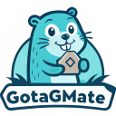

# GoTagMate - VSCode Extension for Go Struct Tags

GoTagMate is a powerful and user-friendly VSCode extension designed to simplify working with Go struct tags. It provides intelligent suggestions, autocompletion, and detailed documentation for popular Go libraries like `json`, `gorm`, and `validate`. Whether you're a beginner or an experienced Go developer, GoTagMate will save you time and reduce errors when writing struct tags.

---

## Features

### **Non-Technical Features**
1. **Automatic Suggestions**:
   - As soon as you type a backtick (\`) in a Go struct, GoTagMate will suggest popular tag options like `json:""`, `gorm:""`, and `validate:""`.

2. **Context-Aware Autocompletion**:
   - After selecting a tag (e.g., `json:""`), GoTagMate will provide relevant suggestions for that specific tag. For example:
     - For `json:""`, it suggests `omitempty`, `string`, and `-`.
     - For `gorm:""`, it suggests `column`, `type`, `index`, and more.
     - For `validate:""`, it suggests `required`, `email`, `rgb`, and more.

3. **Re-trigger Suggestions**:
   - If your cursor is inside double quotes (`""`) and you type a space (` `), equal sign (`=`), semicolon (`;`), or comma (`,`), GoTagMate will re-trigger suggestions to help you complete the tag.

4. **Detailed Documentation**:
   - Hover over any suggested tag to see a detailed description of its purpose and usage examples.

5. **User-Friendly**:
   - Designed to be intuitive and easy to use, even for beginners. No complex setup or configuration is required.

6. **Extensible**:
   - GoTagMate is built to support additional libraries in the future. You can easily extend it to include custom tags or new libraries.

---

### **Technical Features**
1. **Backtick Trigger**:
   - The extension listens for the backtick character (\`) in Go structs and automatically provides suggestions for `json:""`, `gorm:""`, and `validate:""`.

2. **Regex-Based Parsing**:
   - Uses regular expressions to detect the cursor's position and context (e.g., inside double quotes or after a specific tag type).

3. **Dynamic Suggestions**:
   - Suggestions are dynamically generated based on the tag type (`json`, `gorm`, `validate`) and the cursor's position.

4. **Library-Specific Tag Data**:
   - Tag data (e.g., `gorm`, `validate`) is stored in a modular and extensible format (`tags.ts`), making it easy to add support for new libraries.

5. **Re-trigger on Specific Characters**:
   - The extension re-triggers suggestions when the cursor is inside double quotes and encounters specific characters (` `, `=`, `;`, `,`).

6. **Markdown Documentation**:
   - Detailed documentation for each tag is displayed in a Markdown format when hovering over a suggestion.

7. **Optimized Performance**:
   - The extension is designed to be lightweight and fast, ensuring minimal impact on VSCode's performance.

8. **Modular Codebase**:
   - The code is organized into reusable modules (e.g., `completionProvider.ts`, `tags.ts`) for easy maintenance and future extensions.

---

## How It Works

### **For Non-Technical Users**
1. Open a Go file in VSCode.
2. Start typing a struct field and add a backtick (`).
3. GoTagMate will suggest `json:""`, `gorm:""`, and `validate:""`.
4. Select a tag (e.g., `json:""`), and it will provide relevant suggestions (e.g., `omitempty`, `string`).
5. Hover over any suggestion to see detailed documentation.
6. If you're inside double quotes and type a space, equal sign, semicolon, or comma, GoTagMate will re-trigger suggestions to help you complete the tag.

### **For Technical Users**
1. The extension uses a **Completion Provider** to detect the cursor's position and context.
2. When a backtick is typed, it triggers the `provideCompletionItems` method, which suggests initial tags (`json`, `gorm`, `validate`).
3. Once a tag is selected, the extension uses regex to detect the tag type and provides library-specific suggestions.
4. The `getJsonProperties` method extracts JSON properties from the document for `json:""` suggestions.
5. The `createCompletionItem` method generates completion items with detailed documentation.
6. The extension re-triggers suggestions when specific characters (` `, `=`, `;`, `,`) are encountered inside double quotes.

---

## Installation

1. Open VSCode.
2. Go to the Extensions view by clicking on the Extensions icon in the Activity Bar on the side of the window or by pressing `Ctrl+Shift+X`.
3. Search for "GoTagMate".
4. Click the Install button.

---

## Usage

1. Open a Go file in VSCode.
2. Start typing a struct field and add a backtick (`).
3. Select a tag from the suggestions (e.g., `json:""`).
4. Use the suggestions to complete the tag.
5. Hover over any suggestion to see detailed documentation.

---

## Supported Libraries

1. **JSON**:
   - Tags: `omitempty`, `string`, `-`.
   - Description: Simplifies JSON serialization and deserialization.

2. **GORM**:
   - Tags: `column`, `type`, `index`, `unique`, `constraint`.
   - Description: Helps define database schema and relationships.

3. **Validate**:
   - Tags: `required`, `email`, `rgb`, `min`, `max`.
   - Description: Provides field validation for structs.

---

## Roadmap

1. **Add Support for More Libraries**:
   - Extend GoTagMate to support additional libraries like `xml`, `yaml`, and `bson`.

2. **Custom Tag Definitions**:
   - Allow users to define custom tags and suggestions.

3. **Enhanced Documentation**:
   - Add more detailed usage examples and links to official documentation.

4. **Configuration Options**:
   - Add settings to enable/disable specific libraries or customize trigger characters.

---

## Contributing

We welcome contributions! If you'd like to add support for a new library or improve the extension, follow these steps:

1. Fork the repository.
2. Create a new branch for your feature or bug fix.
3. Submit a pull request with a detailed description of your changes.

---

## License

GoTagMate is licensed under the MIT License. See the [LICENSE](LICENSE) file for details.

---

## Feedback and Support

If you have any questions, suggestions, or issues, please open an issue on the [GitHub repository](https://github.com/jashezan/GoTagMate). We'd love to hear from you!

---

## Conclusion

GoTagMate is your go-to VSCode extension for working with Go struct tags. It simplifies the process of writing and managing tags, saving you time and reducing errors. Try it out today and experience the difference!

